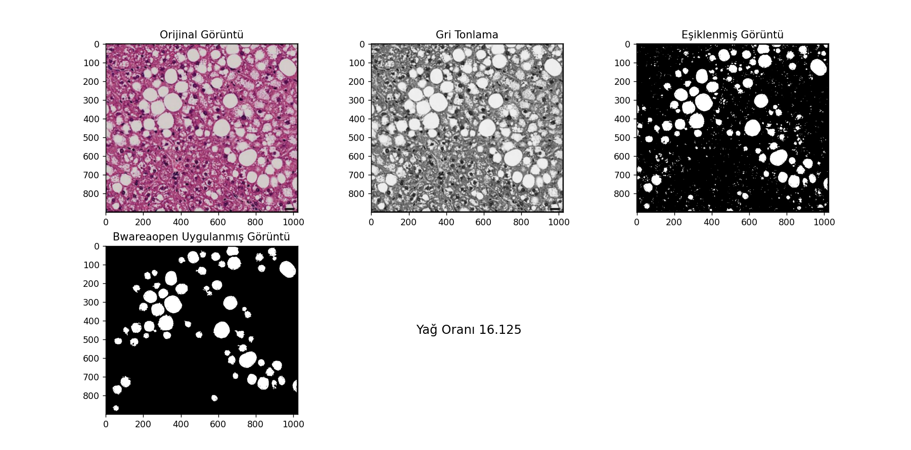
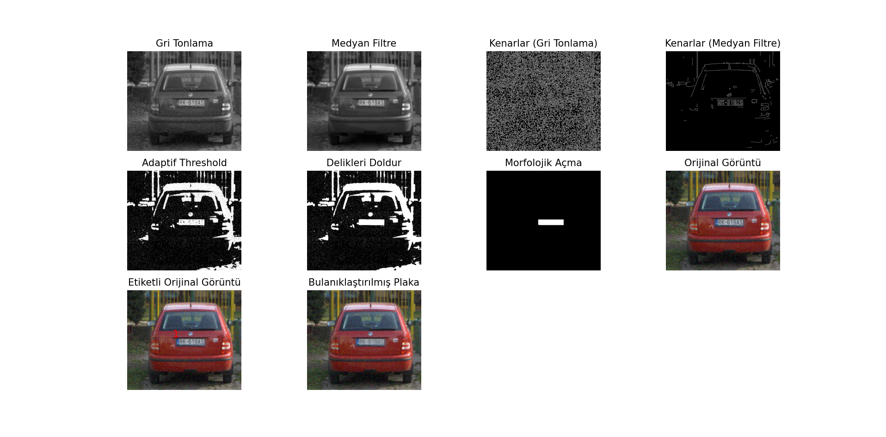

Bu projede dijital görüntü işleme dersinden edinilmiş bilgi birikimini pekiştirmek amacıyla bir aracın plakasını bulanıklaştırmak için neler yapılması gerekiyorsa yapıldı ve başarıyla gerçekleştirildi.

Bir diğer işlem ise elimizdeki bir doku görselinin içerisinde yer alan yağ öbeklerinin dokunun yüzde kaçını oluşturuyor bunu ölçmek için gerekli işlemler uygulandı ve sonuca ulaşıldı.

